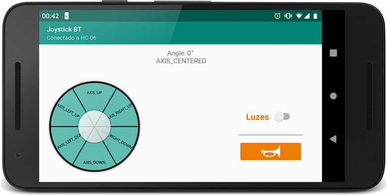

# Android Joystick Bluetooth for Arduino 

O aplicativo é um controle bluetooth, estilo joystick, para interagir com o Arduino e controlar um carrinho.
Controlandos os eixos, luzes e buzina.

#### Telas

| Android Joystick                 | 
|----------------------------------|
|  | 

## Finalidade

- [x] **Estudo**: Este projeto foi criado para fins de aprendizado e prática.
- [ ] **Curso**: Este projeto é parte de um curso específico.
- [ ] **Projeto Real**: Este projeto é uma aplicação real a ser publicado.

Com o estudo o foco é criar um aplicativo que conecte com
arduino ( [Código nesse repositório](https://github.com/fbvictorhugo/carhacking_arduino)) para
controlar um carrinho.

Utilizando a biblioteca [virtual-joystick-android](https://github.com/controlwear/virtual-joystick-android?tab=readme-ov-file#virtual-joystick-android) para fazer o joystick.
*Código da biblioteca está comentado, pois atualmente não está fazendo o download*

### Release

Android apk release,
download [here](https://github.com/fbvictorhugo/joystick_bluetooth/releases/tag/v1.0.0)

##### Command Mapping

| Command         | Char |
|-----------------|------|
| BTN_LED_ON      | 'a'  |
| BTN_LED_OFF     | 'b'  |
| BTN_BUZZ        | 'c'  |
| AXIS_UP         | 'd'  |
| AXIS_DOWN       | 'e'  |
| AXIS_LEFT_UP    | 'f'  |
| AXIS_LEFT_DOWN  | 'g'  |
| AXIS_RIGHT_UP   | 'h'  |
| AXIS_RIGHT_DOWN | 'i'  |
| AXIS_CENTERED   | 'j'  |

## Outras Considerações

Utilizado em diversas apresentações, em GDG e Arduino Day;

**Construção paralizada:** Emeados de 2019;
